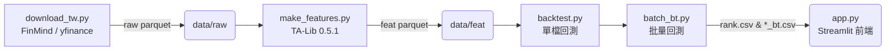

# Data → Feature → Backtest → Streamlit 工作流程

專案的資料流與執行順序如下圖（Mermaid 流程圖在 GitHub 頁面會自動渲染）：

專案目錄速查
smart_invest_mvp/
│  app.py               ← Streamlit 入口
├─data/
│   ├─raw/              ← 原始 OHLCV（parquet）
│   └─feat/             ← 加 TA-Lib 指標
├─reports/
│   ├─rank.csv
│   └─*_bt.csv          ← 回測明細（含 date 欄）
└─src/
    ├─backtest.py       ← 單檔回測
    ├─batch_bt.py       ← 批量回測（呼叫 backtest）
    └─utils/
        ├─download_tw.py
        └─make_features.py

備註
TA-Lib 版本 0.5.1（conda-forge），安裝細節見 docs/SETUP.md。
回測期間目前設定 2019-01-02 ~ 2024-12-31，可在 src/backtest.py 調整 START/END 常數。
*_bt.csv 內已包含 date 欄，Streamlit 資金曲線 X 軸自動以日期顯示。
更詳細的除錯與版本變動請參考 docs/CHANGELOG.md。
